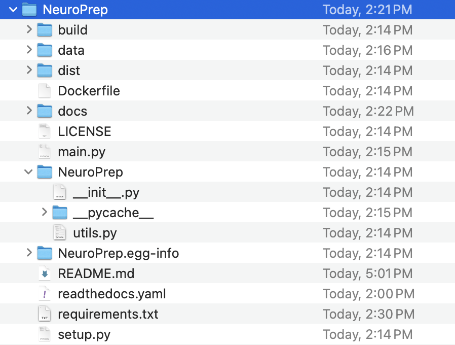

# Reproducible Project Management

Reproducible project management is the cornerstone of efficient and transparent workflows in the development and collaboration world. It involves implementing practices and utilizing tools that ensure the consistent and reliable reproducibility of project results. To ensure reproducibility, creating and publishing packages, and open-source documentation play a key role. In this hands-on session, I will walk you through open-sourcing Python projects with GitHub, publishing packages online through PyPI (Python Package Index), dockerization, and creating detailed documentation with Read the Docs.


## Getting started

The following frameworks are needed to work with this project.
 ### Softwares Installations
```
$ git clone https://github.com/brainhack-vandy/NeuroPreprocessing.git
$ Visual Studio Code installation
$ Docker Desktop installation
$ Python or Anaconda environment
$ pip install numpy nilearn docker setuptools wheel and twine sphinx sphinx_rtd_theme 
```

#### Accounts needed

```
$ GitHub (https://github.com)
$ Python Package Index (PyPI) (https://pypi.org). Make sure you genearte API token and save it on your machine
$ Docker hub (https://hub.docker.com)
$ Read the Docs (https://readthedocs.org)


```

## Developing an fMRI preprocessing pipeline

We will utilize a segment of our fMRI preprocessing tool, NeuroGraph (https://neurograph.readthedocs.io/en/latest/), offering a suite of tools for downloading, preprocessing, and generating graph-based representations and benchmarks. The implementation will be carried out in the Python programming language, and our project follows the structure shown below.

<p align="center">

</p>

The utils.py file contains the implementation for fMRI preprocessing, while the main.py file takes a single example and employs the pipeline to preprocess the data.

## Packaging and publishing Python projects

Publishing packages online offers widespread accessibility, allowing developers and researchers across the globe to easily discover, install, and integrate your software into their projects. To publish our package online, we will use the Python Package Index (PyPI). We will use the setup.py file to configure the package, and then we will use the following terminal commands to create the package. 


```
$ python setup.py sdist bdist_wheel (this command should creates the distribution folder (dist))
$ twine check dist/*   (check the package) 
```

To upload the package to PyPI, we wstart by creating an account on PyPI and acquiring the API key. Utilize the API key to generate a ".pypirc" file, saving it in the home folder (~/.pypirc). An example of the .pypirc file is provided. Following these steps, we proceed to upload the package to PyPI as outlined below.

```
$ twine upload dist/*
```
Out Python package is online and is ready to install with

```
$ pip install NeuroPrep
```
## Containerizing the Package

Dockerization is essential for creating a portable and consistent environment for software applications. Docker images encapsulate an application and its dependencies, ensuring seamless deployment across various environments, reducing compatibility issues. To create a docker image from our package, we do the following. 

First, we create an account on Docker and install Docker Desktop. Then we need to create two files: Dockerfile and requirements.txt. After that, we run the following terminal commands.


```
$ docker build -t --name-of-the-docker-image
$ docker images (check the docker image)
$ docker login   (login to the docker hub)
$ docker push --image-name
$ docker run --image-name  (run the docker)
```

## Creating documentation

Documenting packages/softwares is crucial for providing clear and comprehensive guidance on how to use the software, enabling users to understand its functionality and purpose. Well-documented packages enhance user experience, foster collaboration, and facilitate the troubleshooting process, ensuring that developers can efficiently leverage and contribute to the project.

We will use Read the Docs to automatically construct documentation for our project and publish it online. To do so, we do the following.

first, we create an account on GitHub, create a repository for our pacakge and upload it there. Then we also create an account on Read the Docs to host our documentation.

we do the following:

```
$ mkdir docs (under the NeuroPrep directory)
$ cd docs
$ sphinx-quickstart (we follow the terminal and provide the desired information)
```
We then need to update the config.py, index.rst, and utils.rst files under the docs directory. The example files have been provided in the source code. Afterward, we run the following command. 

```
$ make html
```
We have successfully created the documenatation. The index.html (main page) can be found under docs/_build/html/.

### Publishing the documentation 

To initiate the documentation publishing process, start by creating a readthedocs.yaml file that configures settings for the project. Subsequently, upload the latest package along with all the files to GitHub. Proceed to log in to https://readthedocs.org, click on "import a project," select your project from GitHub, and follow the provided steps. Once completed, build your package, and congratulations, your package and its documentation are now published.


